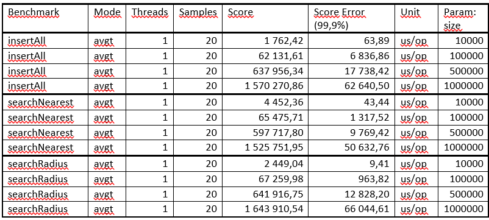
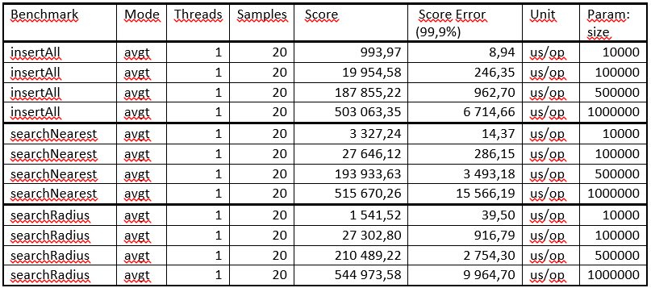
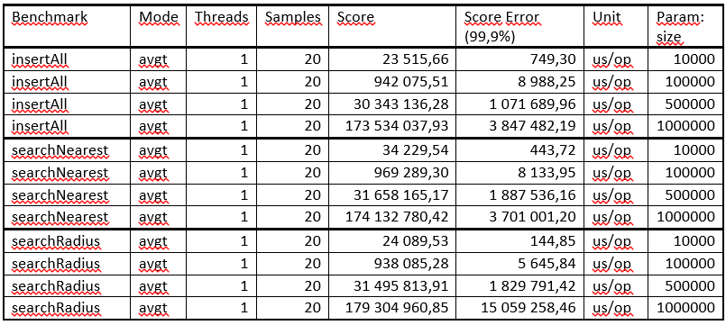
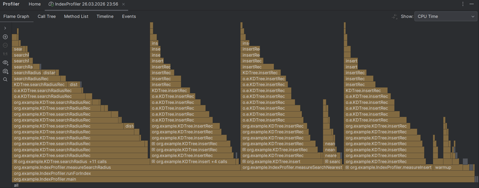
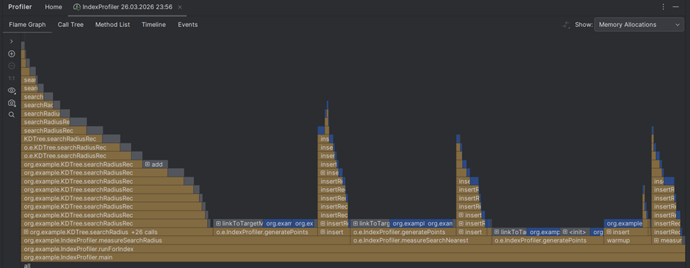
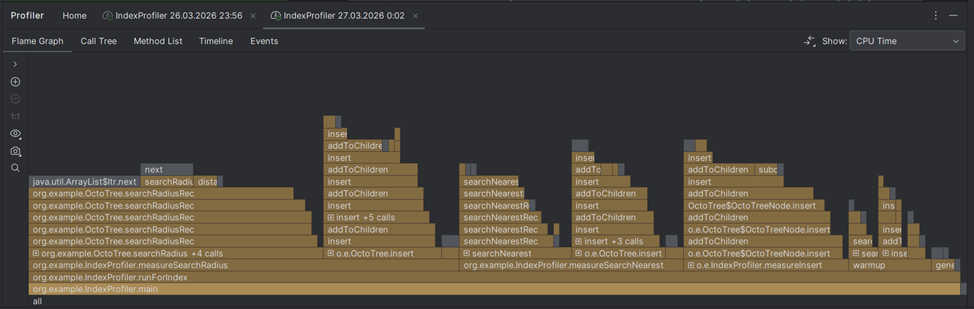
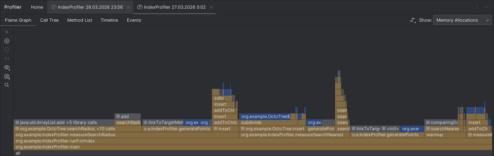
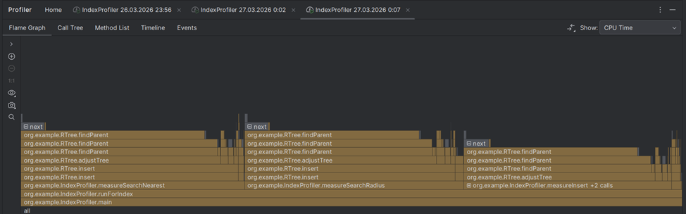
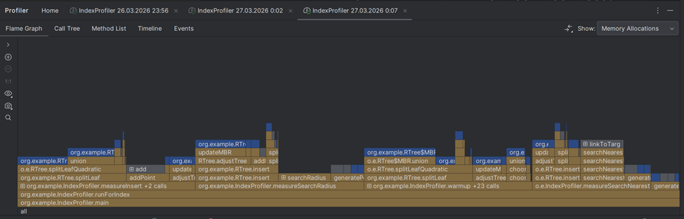

# Лабораторная работа №2
## «Реализация геопоиска по Lat/Lng по карте»

**Студент:** Денисова Мария  
**Группа:** P4135  
**Факультет:** ФПИ и КТ

---

## Задание

Что должна уметь система:

- Помещать географически расположенные объекты
- Искать объекты по координатам --- очевидно, не по точным (тут бы хватило любого KV), а близким

В работе также требуется:

- Написать бенчмарки, в которых показать либо сравнение алгоритма с разумными аналогами, либо изменение времени работы алгоритма в зависимости от размера данных (размер БД, запрашиваемые ключи и точность)

---

## Реализация

В лабораторной работе реализован механизм геопоиска, основанный на трех структурах данных:

1. **KDTree** — двоичное дерево, рекурсивно разбивающее пространство по одной из координат на каждом уровне. Обеспечивает быстрый поиск k ближайших соседей и поиск в радиусе за счёт отсечения ветвей, не пересекающих область запроса. Вставка выполняется за O(log n) в сбалансированном случае, но при несбалансированных данных может вырождаться в O(n).

2. **RTree** — иерархическая структура, группирующая объекты в минимальные ограничивающие прямоугольники (MBR). Узлы могут содержать переменное количество записей, что обеспечивает адаптивность к динамическим данным. Поиск требует обхода узлов, чьи MBR пересекают область запроса. Качество поиска зависит от минимизации перекрытия MBR.

3. **OctoTree** — разбивает пространство на четыре квадранта, рекурсивно деля области до достижения порога точек в узле. Позволяет быстро локализовать точки в заданном радиусе за счёт отсечения квадрантов, не пересекающих круг. Эффективно при равномерном распределении данных, но может создавать глубокие ветви при неравномерном распределении.

---

## Тестирование

Замеры бенчмарков осуществлялись с помощью JMH:
> - VM version: JDK 25.0.1, OpenJDK 64-Bit Server VM, 25.0.1+8-27
> - VM invoker: C:\Users\dmp12\.jdks\openjdk-25.0.1\bin\java.exe
> - VM options: -javaagent:D:\IntelliJ IDEA Community Edition 2025.2.1\lib\idea_rt.jar=2613 -Dfile.encoding=UTF-8 -Dsun.stdout.encoding=UTF-8 -Dsun.stderr.encoding=UTF-8
> -Blackhole mode: compiler (auto-detected, use -Djmh.blackhole.autoDetect=false to disable)
> - Warmup: 5 iterations, 1 s each
> - Measurement: 20 iterations, 1 s each
> - Timeout: 10 min per iteration
> - Threads: 1 thread, will synchronize iterations
> - Benchmark mode: Average time, time/op

Для каждого алгоритма сделаны отдельные benchmark-методы (построение, поиск, вставка/чтение). Размеры входных данных задаются через @Param (10000, 100000, 500000, 1000000). Результаты автоматически сохраняются в CSV (target/jmh-results).
Все замеры проводились на ноутбуке со следующими характеристиками:
-	Операционная система – Windows 10 (64-разрядная операционная система, процессор x64)
-	Процессор: AMD Ryzen 7 4700U with Radeon Graphics 2.00 GHz, 8 ядер
-	Оперативная память: 16,0 ГБ
-	Видеоадаптер: AMD Radeon(TM) Graphics (2 GB)
Во время проведения замеров ноутбук был подключен к сети.

### 1) KDTree

### 2) OctoTree

### 3) RTree

**Графики, визуализирующие результаты бенчмарков, представлены в pdf-отчете в папке report*

---

## Выводы по бенчмаркам

- **insertAll** — Вставка: OctoTree демонстрирует наиболее быстрое построение: для 1 млн точек примерно 0,5 млн us/op, что почти втрое быстрее KDTree. Это объясняется тем, что вставка ограничена локальными разбиениями и не требует рекурсивного поиска по всем уровням для каждой точки. RTree имеет наименьшую производительность вставки.

- **searchRadius** — Поиск в радиусе: KDTree и OctoTree показывают схожее время поиска, с небольшим преимуществом OctoTree. OctoTree вероятно быстрее благодаря жёсткому отсечению по квадрантам, в то время как KDTree может посещать больше ветвей из-за неоптимального разбиения. RTree также сильно отстает в данном тесте.

- **searchNearest** — Поиск ближайших объектов: Картина аналогична предыдущему тесту. KDTree и OctoTree демонстрируют близкие результаты, но OctoTree снова опережает KDTree. RTree сильно отстает и имеет большую погрешность.

Таким образом, структура OctoTree показала наилучшее время выполнения как для вставки, так и для поиска (в 2–3 раза быстрее KDTree и на порядки быстрее RTree) в текущей реализации. По результатам тестирования она является оптимальным выбором. Однако, стоит отметить, что результат бенчмарков OctoTree частично обусловлен оптимальным выбором границ: границы области для заданной генерации точек обеспечивают покрытие всех точек и минимизируют пустое пространство. То есть в текущей настройке бенчмарк показывает потенциально достижимую производительность.

---

## Профайлинг

Профайлинг осуществлялся с помощью IntelliJ Profiler для 500000 точек. Для этого использовался класс IndexProfiler.

### 1) KDTree

### 2) OctoTree

### 3) RTree

**Более детальный профайлинг(дополнительные скриншоты) представлен в pdf-отчете в папке report*

---

## Выводы по профайлингу

Результаты профайлинга показывают, что основное время выполнения (CPU time) у RTree приходится на рекурсивные вызовы методов findParent и adjustTree, которые многократно вызываются в процессе вставки и последующей корректировки дерева. Это объясняет крайне низкую производительность RTree, зафиксированную в бенчмарках. Основное выделение памяти в RTree происходит при вызове операции с MBR.

В KDTree и OctoTree «горячими» точками являются вычисления расстояний и рекурсивные обходы.

Таким образом, профайлинг показал, что низкая производительность RTree обусловлена комбинацией неэффективных алгоритмов (квадратичное разделение, поиск родителя) и избыточного создания объектов (MBR, временные списки). KDTree и OctoTree, напротив, демонстрируют минимальные аллокации и более равномерное использование CPU, что коррелирует с их высокими показателями в бенчмарках. Для практического применения в задачах геопоиска предпочтительны OctoTree или KDTree, а RTree требует значительной доработки.