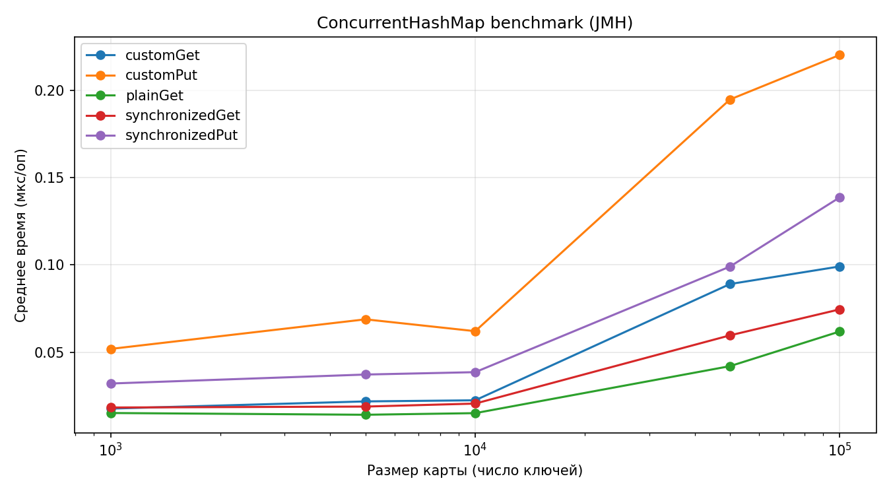
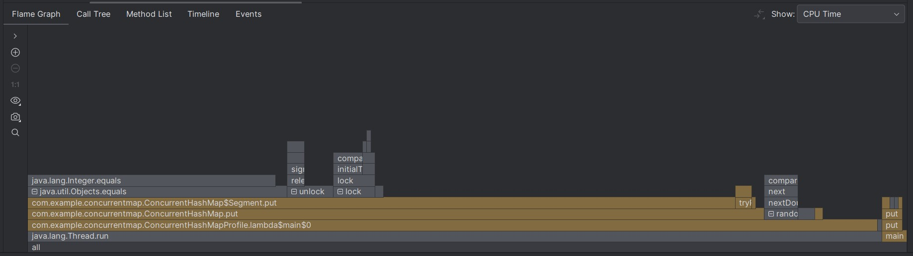
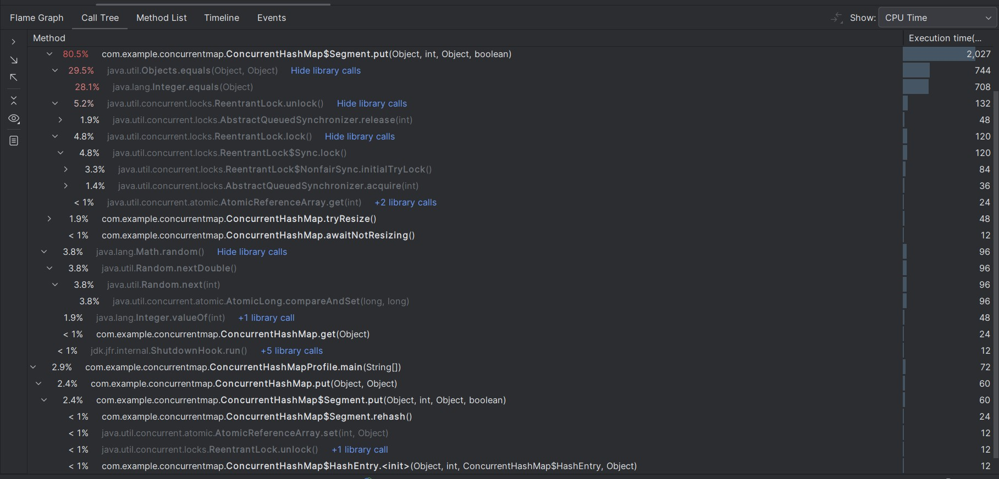
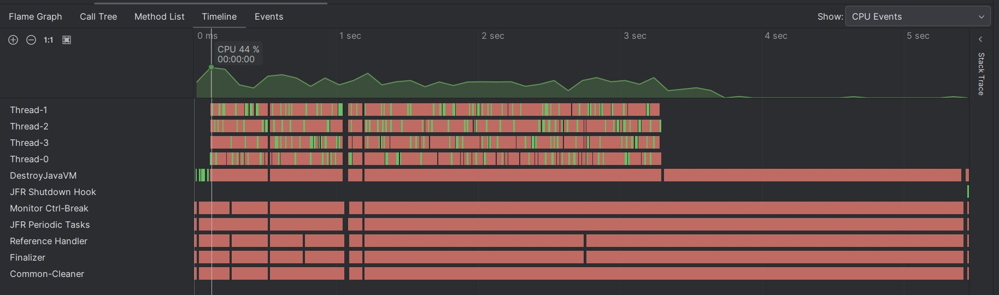
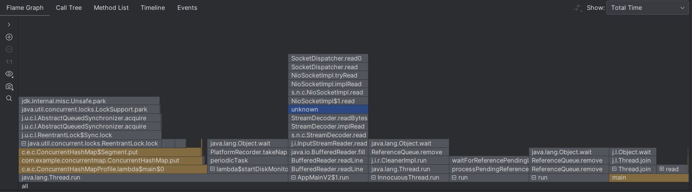
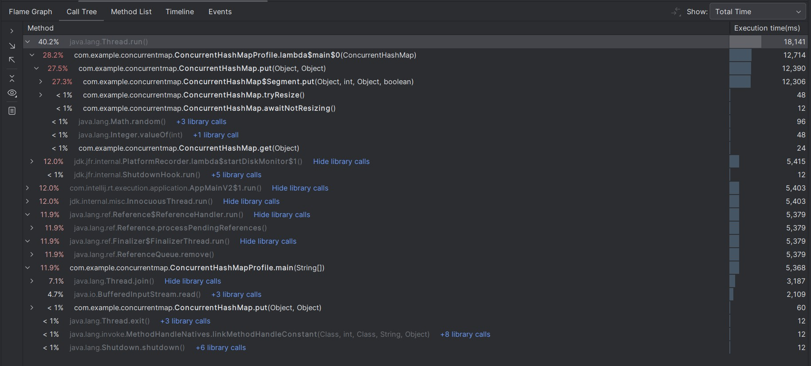
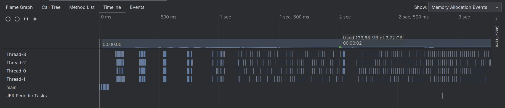

# Лабораторная работа №4
## «Реализация concurrent hash-map»

**Студент:** Денисова Мария  
**Группа:** P4135  
**Факультет:** ФПИ и КТ

---

## Задание

Требуется реализовать thread-safe хеш-таблицу с закрытой адресацией.

Требования к структуре:
- минимально необходимый набор операций: put(key: K, value: V), get(key: K) -> V, size() -> usize, clear(), merge(key: K, value: V, merger: Fn(V, V) -> V) -> V, итератор по парам ключ-значения
- (почти) никогда не блокирующие операции чтения
- однозначный наблюдаемый порядок между завершёнными операциями
За более формальной спецификацией см. Javadoc к ConcurrentHashMap (https://docs.oracle.com/en/java/javase/25/docs/api/java.base/java/util/concurrent/ConcurrentHashMap.html) в JDK.
При этом не требуется реализовывать конкретный интерфейс для таблицы из выбранного ЯП, это просто референс.

В работе также требуется:
- Написать бенчмарки (сравнивать перф уместно с не-thread-safe версией)
- Написать concurrency-тесты с использованием специализированного инструментария (например, если Java, jcstress)
- Нарисовать графики по числовым результатам
- Объяснить интересные результаты в отчётё
---

## Реализация

В рамках работы реализована потокобезопасная хеш-таблица с **закрытой адресацией** (отдельные цепочки коллизий в каждой корзине),
с набором операций, близким к `java.util.concurrent.ConcurrentHashMap` JDK.

### Структура данных и общая идея

Таблица разбита на **сегменты** — степень двойки, по умолчанию 16 (`DEFAULT_CONCURRENCY_LEVEL`). 
Число сегментов может **динамически удваиваться** (до `MAX_SEGMENTS = 65536`), когда средняя загрузка сегментов 
превышает половину порога рехэширования. Состояние сегментов хранится в объекте `SegmentState` (массив сегментов, 
`segmentShift`, `segmentMask`); при ресайзе создаётся новый `SegmentState`, а старые данные переносятся под глобальными 
блокировками старых сегментов.

Каждый сегмент — объект `Segment`, наследующий `ReentrantLock`, с собственной **таблицей корзин** (`AtomicReferenceArray`), 
счётчиком `count` и порогом `threshold`. Ключ попадает в сегмент по старшим битам перемешанного хэша; 
запись в разных сегментах сериализуется разными блокировками.

Внутри сегмента — **цепочки** узлов `HashEntry`: ключ, кэшированный `hash` (без повторного `hashCode` при сравнении), 
`volatile` значение и ссылка `next`. При переполнении сегмента выполняется локальный **rehash** — удвоение числа корзин внутри сегмента.

Глобальный ресайз сегментов координируется флагом `resizeInProgress` (CAS) и счётчиком `resizeStamp`. 
Пока ресайз идёт, потоки ждут в `awaitNotResizing()` (`Thread.onSpinWait()`). Операции `get`, `put`, `putIfAbsent` 
и `merge` выполняются в цикле: снимается `resizeStamp` и ссылка на `state`, выполняется доступ к сегменту, 
затем результат принимается только если штамп и `state` не изменились — иначе операция повторяется. 
Это не даёт вернуть данные из устаревшего распределения после удвоения числа сегментов.

### Реализованные операции

- **`get`** — **без блокировки** сегмента: чтение корзины, `VarHandle.loadLoadFence()`, обход цепочки по кэшированному `hash`; при изменении `resizeStamp`/`state` — повтор.
- **`put` / `putIfAbsent`** — под блокировкой сегмента, с вызовом `tryResize()` перед записью; при переполнении корзин — `rehash` внутри сегмента; для новой вставки — `VarHandle.storeStoreFence()` перед увеличением `count`.
- **`merge`** — под блокировкой; `null` из remapper удаляет ключ (пересборка корзины).
- **`clear`** — блокируются все сегменты карты, затем `clear` в каждом; внутри сегмента сначала `count = 0`, барьер записи, затем обнуление корзин.
- **`size`** — суммирование `count` по сегментам текущего `state` без блокировок (ожидание завершения ресайза через `awaitNotResizing()`); результат ограничивается `Integer.MAX_VALUE`.
- **`iterator`** — снимок `state` на момент создания итератора, обход корзин без блокировок; пары «ключ–значение» неизменяемые.

## Тестирование

### Модульные и многопоточные тесты (JUnit)

Класс [ConcurrentHashMapTest.java](src/test/java/com/example/concurrentmap/ConcurrentHashMapTest.java) покрывает:

- базовые `put` / `get` и перезапись значения;
- `putIfAbsent`;
- `merge` (включая удаление ключа, если remapper возвращает `null`);
- отказ от `null` в ключах и значениях (в т.ч. в `get`, `putIfAbsent`, `merge`);
- `size`, `clear`, обход `iterator`;
- **конкурентную вставку** (4 потока × 1000 ключей, старт по `CountDownLatch`) с проверкой `size == 4000` и наличия всех ключей;
- **динамический ресайз сегментов**: карта с `concurrencyLevel = 1`, после 1000 вставок через reflection проверяется рост числа сегментов, сохранение `size` и всех значений.

### Нагрузочные измерения (JMH)

Класс [ConcurrentHashMapBenchmark.java](src/test/java/com/example/concurrentmap/ConcurrentHashMapBenchmark.java) сравнивает среднее время одной операции (`Mode.AverageTime`, мкс) для реализации, `HashMap` и `Collections.synchronizedMap` на предзаполненных картах (`@Param`: 1000 … 100000 ключей). Сценарии: случайный `get` и `put` по существующим ключам. `HashMap` в группе `plainMapGet` измеряется в **одном потоке** (`@GroupThreads(1)`), так как структура не потокобезопасна. Результаты сохраняются в CSV под `target/jmh-results/`.

Все замеры проводились на ноутбуке со следующими характеристиками:
-	Операционная система – Windows 10 (64-разрядная операционная система, процессор x64)
-	Процессор: AMD Ryzen 7 4700U with Radeon Graphics 2.00 GHz, 8 ядер
-	Оперативная память: 16,0 ГБ
-	Видеоадаптер: AMD Radeon(TM) Graphics (2 GB)
Во время проведения замеров ноутбук был подключен к сети.

Ниже — сводка прогона `target/jmh-results/ConcurrentHashMapBenchmark-20260522-160745.csv` (22.05.2026). Режим измерения:

- `BenchmarkMode(Mode.AverageTime)`
- `OutputTimeUnit(TimeUnit.MICROSECONDS)`
- `State(Scope.Benchmark)`
- `Fork(value = 3, warmups = 1)`
- `Warmup(iterations = 3, time = 1)`
- `Measurement(iterations = 10, time = 2)`

**Операция `get` (мкс/оп., 99,9% доверительный интервал):**

| Число ключей | `HashMap` (1 поток) | `Collections.synchronizedMap` | Реализация (`ConcurrentHashMap`) |
|-------------:|--------------------:|------------------------------:|---------------------------------:|
| 1000 | 0,015150 ± 0,000820 | 0,018303 ± 0,000415 | 0,017674 ± 0,000210 |
| 5000 | 0,014148 ± 0,000690 | 0,018839 ± 0,000488 | 0,021795 ± 0,003530 |
| 10000 | 0,015076 ± 0,000114 | 0,020548 ± 0,000203 | 0,022435 ± 0,002421 |
| 50000 | 0,041989 ± 0,001103 | 0,059628 ± 0,002813 | 0,089020 ± 0,002843 |
| 100000 | 0,061836 ± 0,001455 | 0,074510 ± 0,001740 | 0,099099 ± 0,002452 |

**Операция `put` (мкс/оп.):**

| Число ключей | `Collections.synchronizedMap` | Реализация (`ConcurrentHashMap`) |
|-------------:|------------------------------:|---------------------------------:|
| 1000 | 0,032044 ± 0,003026 | 0,051864 ± 0,007414 |
| 5000 | 0,037185 ± 0,004019 | 0,068811 ± 0,002140 |
| 10000 | 0,038552 ± 0,000528 | 0,062019 ± 0,001205 |
| 50000 | 0,099025 ± 0,004671 | 0,194732 ± 0,012922 |
| 100000 | 0,138652 ± 0,003912 | 0,220232 ± 0,009312 |

На малых размерах (до 10 000 ключей) `get` у реализации сопоставим с `synchronizedMap` 
и лишь немного медленнее `HashMap` — накладные расходы дают lock-free чтение, 
барьеры памяти и проверка `resizeStamp`. На 50 000–100 000 ключей разрыв с `synchronizedMap` растёт: 
длиннее цепочки в корзинах и дороже индексация при большем числе сегментов и корзин после ресайза. Для `put` реализация 
стабильно медленнее из‑за блокировки сегмента, возможного `rehash` и координации глобального ресайза; 
тем не менее на 100 000 ключей время записи (~0,22 мкс) существенно ниже, чем в раннем прогоне 
до доработки ресайза (~0,48 мкс), что согласуется с переносом данных при удвоении сегментов без потери корректности.

### Тесты на гонки (JCStress)

Подключён **JCStress**. Шесть сценариев:

**Базовая корректность и видимость**

1. [JCStressTestPutGetVisibility.java](src/test/java/com/example/concurrentmap/JCStressTestPutGetVisibility.java) — после завершения `put` два читателя (синхронизация через `AtomicInteger`) должны видеть значение; запрещён исход «put завершён, но никто не увидел».
2. [JCStressTestClearGetRace.java](src/test/java/com/example/concurrentmap/JCStressTestClearGetRace.java) — гонка `clear` и пары `get(1)` + `size()`; запрещено «ключа нет, но `size > 0`».
3. [JCStressTestMergeConsistency.java](src/test/java/com/example/concurrentmap/JCStressTestMergeConsistency.java) — параллельный `merge` по одному ключу; финальные значения в допустимом диапазоне.

**Ресайз сегментов** (карта с `concurrencyLevel = 1`)

4. [JCStressResizeVisibility.java](src/test/java/com/example/concurrentmap/JCStressResizeVisibility.java) — один поток наращивает таблицу (500 вставок), другой пишет ключ `999999`; арбитр должен прочитать `42`, иначе запись потеряна при ресайзе.
5. [JCStressResizeConsistency.java](src/test/java/com/example/concurrentmap/JCStressResizeConsistency.java) — два потока вставляют диапазоны 0–99 и 100–199; ожидается `size = 200` и 100 найденных ключей из второго диапазона.
6. [JCStressResizeLostUpdate.java](src/test/java/com/example/concurrentmap/JCStressResizeLostUpdate.java) — массовая вставка и отдельный `put(10000)`; запрещены потеря ключа и `get(10000) == null` при ненулевом `size`.

### Профилирование

Профилирование осуществлялось с помощью IntelliJ Profiler для 1 млн ключей. 
Для этого использовался класс [ConcurrentHashMapProfile.java](src/test/java/com/example/concurrentmap/ConcurrentHashMapProfile.java).

## Заключение

Реализована сегментированная хеш-таблица с закрытой адресацией, lock-free чтением в сегменте, 
локальными блокировками на запись и динамическим удвоением числа сегментов. 
JUnit и JCStress проверяют функциональность, конкурентные вставки, ресайз и гонки при `clear` и слиянии; 
JMH бенчмарк демонстрирует хороший результат на чтении, но заметное отставание на записи при больших таблицах.

